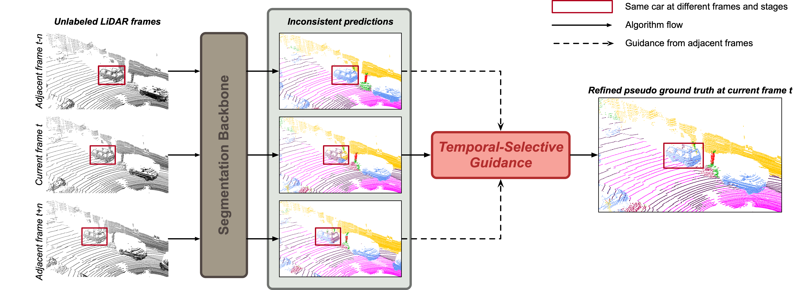

<h1 align="center">TSG-Seg: Temporal-Selective Guidance for Semi-Supervised Semantic Segmentation of 3D LiDAR Point Clouds
</h1>


## Abstract
LiDAR-based semantic scene understanding holds a pivotal role in various applications, including remote sensing and autonomous driving. However, the majority of LiDAR segmentation models rely on extensive and densely annotated training datasets, which is extremely laborious to annotate and hinder the widespread adoption of LiDAR systems. Semi-supervised learning (SSL) offers a promising solution by leveraging only a small amount of labeled data and a larger set of unlabeled data, aiming to train robust models with desired accuracy comparable to fully supervised learning. A typical pipeline of SSL involves the initial use of labeled data to train segmentation models, followed by the utilization of predictions generated from unlabeled data, which are used as pseudo-ground truths for model retraining. However, the scarcity of labeled data limits the capture of comprehensive representations, leading to the constraints of these pseudo-ground truths in reliability. We observed that objects captured by LiDAR sensors from varying perspectives showcase diverse data characteristics due to occlusions and distance variation, and LiDAR segmentation models trained with limited labels prove susceptible to these viewpoint disparities, resulting in inaccurately predicted pseudo-ground truths across viewpoints and the accumulation of retraining errors. To address this problem, we introduce the Temporal-Selective Guided Learning (TSG-Seg) framework. TSG-Seg explores temporal cues inherent in LiDAR frames to bridge the cross-viewpoint representations, fostering consistent and robust segmentation predictions across differing viewpoints. Specifically, we first establish point-wise correspondences across LiDAR frames with different time stamps through point registration. Subsequently, reliable point predictions are selected and propagated to points from adjacent views to the current view, serving as strong and refined supervision signals for subsequent model re-training to achieve better segmentation. Extensive experiments conducted on multiple datasets demonstrate the effectiveness of TSG-Seg, showing competitive performance and robustness in various settings ranging from data-limited to data-abundant scenarios.
## Methodology



## Installation
The code has been tested with A100/V100/RTX 3090, Python 3.8, Pytorch 1.13.0, CUDA 11.6, TorchSparse 1.4.
Any other version may require to update the code for compatibility.

You also need to install:
- tqdm

## Preparation
### SemanticKITTI
Download SemanticKITTI follow the instructions [here](http://www.semantic-kitti.org). Then, please prepare the dataset as follows:
```
./
├── 
├── ...
└── dataset/
      └── sequences
            ├── 00/           
            │   ├── velodyne/	
            |   |	   ├── 000000.bin
            |   |	   ├── 000001.bin
            |   |	   └── ...
            │   ├── labels/ 
            |   |      ├── 000000.label
            |   |      ├── 000001.label
            |   |      └── ...
            |   ├── calib.txt
            |   ├── poses.txt
            |   └── times.txt
            └── ...
```
## SemanticPOSS
Download SemanticPOSS follow the instructions [here](http://www.poss.pku.edu.cn/semanticposs.html). Then, please prepare the dataset as follows:
```
./
├── 
├── ...
└── dataset/
      └── sequences
            ├── 00/           
            │   ├── velodyne/	
            |   |	   ├── 000000.bin
            |   |	   ├── 000001.bin
            |   |	   └── ...
            │   ├── labels/ 
            |   |      ├── 000000.label
            |   |      ├── 000001.label
            |   |      └── ...
            │   ├── tag/     
            |   ├── instances.txt
            |   ├── calib.txt
            |   └── poses.txt
            |   
            └── ...
```
